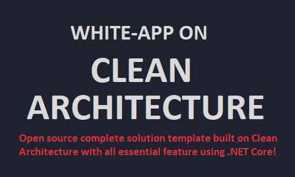

# Complete solution for Clean architecture using .NET Core

 

  

  <h3 align="center">Clean Architecture</h3>

  

    Complete solution template which is built on Clean Architecture with all essential feature using .NET Core!
     
    <a href="https://amitpnk.github.io/Clean-Architecture-ASP.NET-Core"><strong>Explore the docs »</strong></a>
     
     
    <a href="https://marketplace.visualstudio.com/items?itemName=AmitNaik.CleanArchitecture">Download from Marketplace</a>
    ·
    <a href="https://github.com/Amitpnk/Clean-architecture-ASP.NET-Core/issues">Report Bug</a>
    ·
    <a href="https://github.com/Amitpnk/Clean-architecture-ASP.NET-Core/issues/new">Request Feature</a>
  

## Give a Star! :star:
If you like or are using this project to learn or start your solution, please give it a star. Thanks!

## Support This Project

If you have found this project helpful, either as a library that you use or as a learning tool, please consider buying me a coffee:

## Clean Architecture

Clean Architecture was introduced by by Robert C. Martin (Uncle Bob) to provide a better way to build applications in perspective of better testability, maintainability, and dependability on the infrastructures like databases and services

Domain in center and building layer top of it. You can call it as Domain-centric Architecture too.

Though layer architectures like onion, Hexagonal all vary somewhat in their details, they are very similar. All DDD approach have the same objective, which is the separation of concerns. 

### Reference

* [Clean Architecture by Robert C. Martin (Uncle Bob)](https://blog.cleancoder.com/uncle-bob/2012/08/13/the-clean-architecture.html)

## About The Project

This project provides complete solution which is built on Clean Architecture with all essentia,  feature CI/CD, best practice, testing Strategy using .NET Core.

## Technology stack

Architecture Pattern

- [x] Clean architecture
- [x] (Includes)
    - [x] Screaming architecture-[Functional organisation design](http://blog.cleancoder.com/uncle-bob/2011/09/30/Screaming-Architecture.html)
    - [x] Onion archhitecture

Design Pattern
- [x] CQRS design pattern
- [ ] Decorator design pattern
- [x] Mediator design pattern
- [x] Repository design pattern
- [x] Unit of work 
- [x] Factory design pattern
 
Backend
- [x] Language: C#
- [x] Framework: dotnet core 5, ASP.NET Core

UI
- [ ] Blazor

Database
- [x] MS SQL and Inmemory DB
- [x] DB Connectivity : Entityframework Core - Code First

Cloud server
- [x] Azure (deployment script)

Service
- [x] Web API (Restful service)
- [ ] gRPC
- [ ] Graphql

Feature
- [x] Dataseeding
- [x] Custom Exceptionn Handler
- [x] Automapper
- [x] Fluent validation
- [x] Serilog
- [x] Swagger UI
- [x] Advanced Pagination
- [x] API Versioning
- [ ] User Auditing
- [x] Mailkit (Mail service)
- [ ] Hangfire
- [ ] Miniprofiler
- [x] Enabling CORS with CustomPolicy

Authentication
- [x] JWT Authentication

Monitoring tool
- [x] Health check UI
- [ ] Kibana dashboard  

Testing
- [x] Unit testing (Nunit)
- [x] Integration testing

Caching
- [ ] Inmemory Caching
- [ ] Distributed Redis Caching

CI/CD
- [ ] Task runner: .Net core and CircleCI
- [ ] Coverage report: Sonarcloud.io
- [ ] Quality report: Codacy
- [ ] Docker image and Kubernate
- [ ] Cloud server: Azure for cloud

Documentation
- [x] Conventional commit - commit and commit message    
- [x] Docsify

## Licence Used

See the contents of the LICENSE file for details

## Contact

Having any issues or troubles getting started? Drop a mail to amit.naik8103@gmail.com or [Raise a Bug or Feature Request](https://github.com/Amitpnk/Clean-architecture-ASP.NET-Core/issues/new). Always happy to help.
